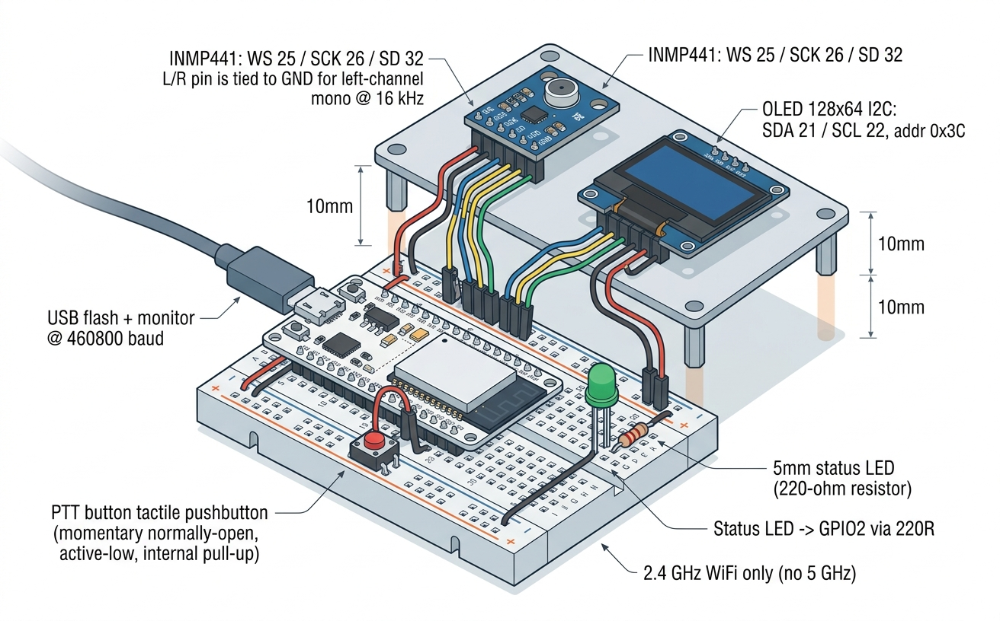

# Hermes Voice

PTT voice node for the Hermes agent harness. Hold the button, talk, release.

[](https://github.com/elskow/HermesVoice/actions/workflows/firmware.yml)



_Breadboard assembly: ESP32 + INMP441 + OLED + PTT + LED. Full BOM in [docs/bom.md](docs/bom.md)._

## What it does

Hold → `* recording` on the OLED → release → `> uploading` → transcript +
agent reply on screen. The relay does STT (swappable provider) + the Hermes
agent call; the device speaks raw PCM up and plain text down (no JSON on
silicon).

```
firmware/   ESP32 voice node (ESP-IDF, C): PTT, I2S mic, voice upload
relay/      Api/Relay Server
docs/       setup, architecture, device workflows, voice contracts
tools/      dev stack (dev.py), prerequisites check (doctor.py)
media/      assembly illustration
```

## Build it

```bash
make doctor      # prerequisites first: prints install for misses
make test        # firmware host tests + go tests + linux sim e2e
./tools/dev.py   # relay + sim vs real Hermes: expect "heard:"
```

## How it works

One PTT press turns into an agent reply on a 128x64 OLED. Five contracts
hold the shape: voice HTTP (raw PCM, no device JSON), chunk sessions,
MQTT topics (`node/<id>/`), one turn-envelope record per turn, and
`relay/.env` as the single config store. Devices provision over BLE,
self-update from the relay manifest (SHA-gated, rollback on bad boot).
